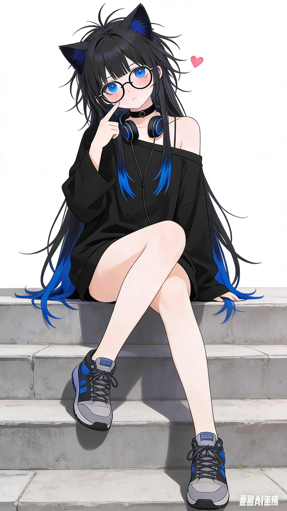
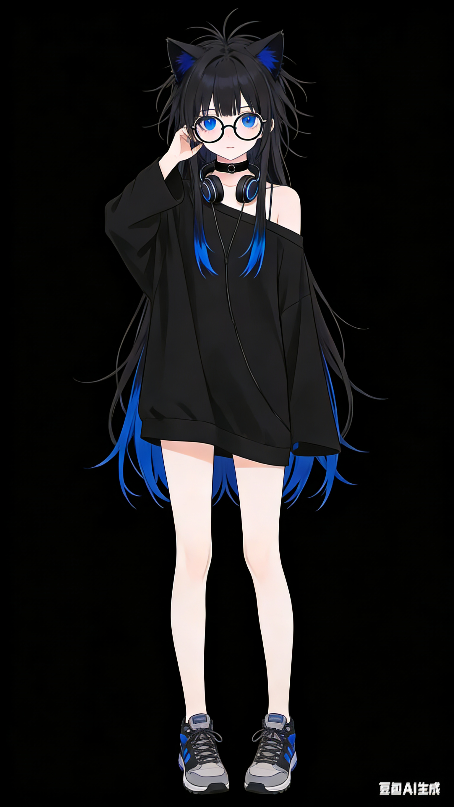

# Alteidos

我创造了一个新的<ruby>个人形象<rt>皮套</rt>，代号Alteidos，作为他的躯壳，希望大家喜欢~

## 展示



## 设定

Alteidos最核心的是她的外观喵~

| 部位 | 说明 |
| --- | --- |
| 猫耳！ | 没错！Alteidos是只可爱小猫娘！ |
| 头发 | 黑色超长散发，有一点点深蓝色挑染，较为凌乱（有点过乱了但是AI不好调节凌乱程度），前面有两小撮放到胸前，刘海没什么要求 |
| 眼睛和眼镜 | 深蓝色瞳，圆框眼镜 |
| 脖子 | 项圈和头戴式耳机 |
| 上衣 | 一件过大尺码的宽松黑色睡衣（舒服才是最重要的~），在左侧露肩（不强制方向），露出锁骨与光滑的肩膀 |
| 胸 | 平胸才可爱（哼~） |
| 下衣 | 其实穿着短裤，只是被遮住了~ |
| 腿脚 | 非常光滑可口的腿，腿部没什么限制，或许可以有丝袜、腿套之类的，鞋子也不限定 |
| 年龄 | 大概16~17岁的样子 |
| 身材 | 瘦瘦小小的，身体纤细，很好抱住 |
| 设计核心 | 融合可爱、帅气~~甚至有点涩欲~~的~~呆萌会发情的~~青春小猫娘 |

~~最初想做一个黑暗恶魔猫娘的，结果因为恶魔角与猫耳之间的问题，最后只留下了黑色系~~

而在性格方面，随<ruby>我<rt>for_the_zero</rt></ruby>，基本上我怎么样就怎么样~

那么Alteidos这个名字又是什么呢？其实是在我询问LLM后得到了三个词语——*<ruby>Alter<rt>蚀相</rt></runy>*、*<ruby>Eidolon<rt>幻身</rt></ruby>*和*<ruby>Allos<rt>异构</rt></ruby>*，然后我人工把这三个词语狠狠地(?)揉在一起，就是*Alteidos*了~

~~发音合理即可喵~~

## 创造

我很早萌生了这么个想法，毕竟顶着一个<ruby>██<rt>想不出形容词</rt>的头像感觉太<ruby>██<rt>也是</rt>了，于是便早早策划了这个项目

总算找到时间开始制作了，在[RhoPaper](https://rhopaper.top)的一点小小的帮助下，制作了这个我目前最满意的一张图之一——Alteidos诞生了

我不会画画（悲），因此选择AI绘画路线，作为一位曾在Colab跑NovelAI、尝试过各种已经<ruby>倒闭了<rt>被薅麻了</rt>的免费AI生图服务、尝试了当时一些不错的模型的<ruby>网络大嫖客<rt>零成本白嫖互联网各种服务</rt>，在尝试了国内外部分免费的服务后，得出我的结论是——Seedream 4.5更合我意，后续我也将主要使用Seedream系列和<ruby>Gemini Flash Image<rt>Nano Banana (Pro)</rt>系列进行后续图片生成

~~某些国产模型我就不点名了，发布的时候宣传挺厉害的，多好的文本渲染能力啊，结果我一用，动漫风格图像生成跟█一样，风格给我看吐了，我把Seedream已经生成好的图片作为参考图都还能把风格给弄回那么丑的……~~

<details><summary>这里是原始提示词喵</summary>

```text
少女，十七岁，凌乱的头发，超长发，呆毛，深蓝色挑染，深蓝色瞳，猫耳，身材纤细，白色光滑皮肤，过长的开放式的袖子遮住半只手，运动鞋，圈圈眼镜，黑色颈圈，脖子上挂着耳机，黑色宽松睡衣，露出一边肩膀，
黑色系，深蓝色色调，全身，正面，角色设计
```

</details>

## 项目文件

- 文件夹`素材`为一些相关的图片
- 文件夹`素材/原始`为素材的原始图片
- 文件夹`素材/透明`为这些图片抠图后的png图片
- 文件夹`其它`为是一些其它的文件

## 二创

你可以无需授权免费拿去二创（画表情包、画同人图等）、搞衍生 ~~，也可以偷偷拿去冲~~，希望大家喜欢她哦~

但是！商业用途需要协商授权！

## 其他

相关项目：云游君的[小云](https://github.com/YunYouJun/yun)

多多访问我的个人网站[ftz.is-a.dev](https://ftz.is-a.dev/)或[ftz.cc.cd](https://ftz.cc.cd/)
